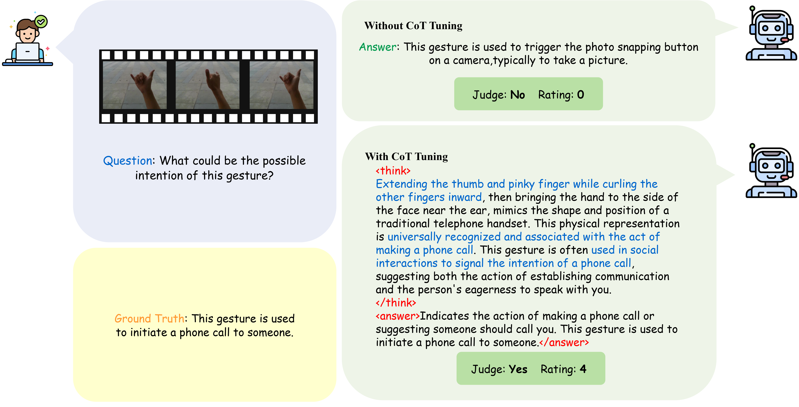

# Gestura
[Demonstration Video](https://drive.google.com/file/d/1gzoQeOIHoLwfEmFdhOBIlHWDTS6NwZ-D/view?usp=drive_link)

# Framework

Overview of the proposed framework of Gestura: Gestura introduces a two-phase training framework for open world gesture understanding

## Landmark Processing Module

## Large Vision Language Model

